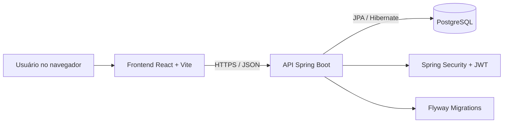

# NeuroPP Ivina

> Sistema web full stack para apresentação institucional, organização de horários, agendamentos e disponibilização de documentos no contexto neuropsicopedagógico.


## Status do projeto

**Em preparação para homologação e deploy.**

Esta versão foi desenvolvida para estudo e portfólio. Utilize apenas dados fictícios durante os testes. O sistema ainda não deve ser tratado como prontuário eletrônico nem usado para armazenar informações clínicas reais.

## Sobre o projeto

O NeuroPP Ivina reúne três partes principais:

```text
Frontend React
      ↓ HTTP/JSON
API Spring Boot
      ↓ JPA/Hibernate
PostgreSQL
```

O frontend apresenta as páginas públicas e as áreas autenticadas. A API concentra autenticação, autorização, validações e regras de negócio. O PostgreSQL armazena usuários, crianças, horários, agendamentos e documentos.

## Arquitetura



## Funcionalidades

### Área pública

- apresentação da profissional e dos serviços;
- informações sobre avaliação neuropsicopedagógica;
- página de contato;
- consulta de horários disponíveis;
- cadastro e login de responsáveis.

### Área do responsável

- acesso protegido por autenticação;
- cadastro e consulta de crianças vinculadas;
- criação de agendamentos;
- consulta, reagendamento e cancelamento;
- acompanhamento do status dos atendimentos;
- consulta de documentos liberados pela administração.

### Área administrativa

- painel protegido pelo perfil `ADMIN`;
- criação e gerenciamento de horários;
- consulta paginada dos agendamentos;
- alteração controlada do status dos atendimentos;
- criação e disponibilização de documentos;
- proteção contra conflitos de horários.

## Tecnologias

### Frontend

- React 19;
- TypeScript 6;
- Vite 8;
- React Router;
- Tailwind CSS 4;
- Lucide React;
- ESLint.

### Backend

- Java 21;
- Spring Boot 3.5;
- Spring Web;
- Spring Security;
- OAuth2 Resource Server;
- JWT;
- Spring Data JPA;
- Bean Validation;
- Flyway;
- Maven;
- JUnit 5 e MockMvc.

### Infraestrutura

- PostgreSQL 17;
- Docker;
- Docker Compose;
- variáveis de ambiente.

## Estrutura do repositório

```text
neuropp-ivina/
├── backend/
│   ├── .mvn/
│   ├── postman/
│   ├── src/
│   ├── .dockerignore
│   ├── .env.example
│   ├── Dockerfile
│   ├── docker-compose.yml
│   ├── mvnw
│   ├── mvnw.cmd
│   └── pom.xml
├── docs/
│   ├── API.md
│   ├── ARCHITECTURE.md
│   ├── DATABASE.md
│   ├── DEPLOYMENT.md
│   ├── DEVELOPMENT.md
│   ├── IMPROVEMENTS.md
│   ├── README.md
│   └── SECURITY.md
├── frontend/
│   ├── public/
│   ├── src/
│   ├── .env.example
│   ├── eslint.config.js
│   ├── index.html
│   ├── package-lock.json
│   ├── package.json
│   ├── tsconfig.app.json
│   ├── tsconfig.json
│   ├── tsconfig.node.json
│   └── vite.config.ts
├── .gitignore
├── LICENSE
└── README.md
```

## Pré-requisitos

Para executar o projeto completo:

- Git;
- Docker Desktop com Docker Compose;
- Node.js 20.19 ou superior;
- Java 21, caso o backend seja executado fora do Docker.

## Clonando o repositório

```bash
git clone https://github.com/ledatrindade/neuropp-ivina.git
cd neuropp-ivina
```

## Executando o backend e o PostgreSQL

Entre na pasta do backend:

```bash
cd backend
```

Crie o arquivo `.env` com base no exemplo.

### Windows PowerShell

```powershell
Copy-Item .env.example .env
```

### Git Bash, Linux ou macOS

```bash
cp .env.example .env
```

Exemplo de configuração local:

```env
POSTGRES_DB=neuropp_db
POSTGRES_USER=neuropp_user
POSTGRES_PASSWORD=troque-por-uma-senha-local-forte
DB_PORT=5433

JWT_SECRET=gere-um-segredo-aleatorio-com-pelo-menos-32-caracteres
JWT_ISSUER=neuropp-ivina-api
JWT_AUDIENCE=neuropp-ivina-web
JWT_ACCESS_TOKEN_TTL=PT1H

CORS_ALLOWED_ORIGINS=http://localhost:5173
APP_TIME_ZONE=America/Recife
BCRYPT_STRENGTH=12

BOOTSTRAP_ADMIN_ENABLED=false
BOOTSTRAP_ADMIN_NAME=Ivina Peixoto
BOOTSTRAP_ADMIN_EMAIL=admin@example.com
BOOTSTRAP_ADMIN_PHONE=81999999999
BOOTSTRAP_ADMIN_PASSWORD=
```

Inicie a API e o banco:

```bash
docker compose up --build
```

Endereços locais:

```text
API:        http://localhost:8080
Health:     http://localhost:8080/api/health
PostgreSQL: localhost:5433
```

Para encerrar os containers:

```bash
docker compose down
```

Para encerrar e apagar o volume local do banco:

```bash
docker compose down -v
```

> O comando com `-v` remove os dados locais armazenados no PostgreSQL.

## Criando o primeiro administrador

O bootstrap administrativo permanece desativado por padrão.

Em um banco vazio:

1. defina temporariamente `BOOTSTRAP_ADMIN_ENABLED=true`;
2. preencha nome, e-mail, telefone e uma senha forte;
3. inicie a API;
4. confirme nos logs que a conta foi criada;
5. altere novamente para `BOOTSTRAP_ADMIN_ENABLED=false`;
6. remova a senha do arquivo local;
7. reinicie a API.

Nunca envie o `.env` ou credenciais administrativas ao GitHub.

## Executando o frontend

Em outro terminal, partindo da raiz do repositório:

```bash
cd frontend
```

Crie o `.env` local.

### Windows PowerShell

```powershell
Copy-Item .env.example .env
```

### Git Bash, Linux ou macOS

```bash
cp .env.example .env
```

Conteúdo esperado:

```env
VITE_API_URL=http://localhost:8080/api
```

Instale as dependências registradas no `package-lock.json`:

```bash
npm ci
```

Inicie o servidor de desenvolvimento:

```bash
npm run dev
```

O frontend normalmente ficará disponível em:

```text
http://localhost:5173
```

## Verificações e testes

### Frontend

```bash
cd frontend
npm run lint
npm run typecheck
npm run build
```

Verificação completa:

```bash
npm run check
```

Visualização local do build:

```bash
npm run preview
```

### Backend no Windows

```powershell
cd backend
.\mvnw.cmd test
```

### Backend no Git Bash, Linux ou macOS

```bash
cd backend
./mvnw test
```

Os testes automatizados utilizam H2 no perfil de teste. A aplicação em execução utiliza PostgreSQL.

## Segurança

Entre as proteções implementadas estão:

- senhas armazenadas com BCrypt;
- autenticação por JWT;
- autorização pelos perfis `ADMIN` e `RESPONSIBLE`;
- validação de emissor, público e expiração do token;
- revogação de tokens anteriores após troca de senha;
- CORS configurado por variável de ambiente;
- validação de entradas com Bean Validation;
- respostas de erro padronizadas;
- limitação de requisições em rotas sensíveis;
- identificação das requisições com `X-Request-Id`;
- bloqueio e restrições contra conflito de agendamento;
- migrations versionadas com Flyway;
- segredos mantidos fora do código-fonte.

A proteção das rotas no frontend melhora a navegação, mas a API é a responsável definitiva por autorizar cada operação.

## Banco de dados

O esquema é controlado por migrations Flyway:

```text
backend/src/main/resources/db/migration/
```

Depois que uma migration for aplicada em um ambiente compartilhado, ela não deve ser alterada. Mudanças futuras devem ser adicionadas em novos arquivos:

```text
V1__create_neuropp_schema.sql
V2__add_new_field.sql
V3__create_audit_table.sql
```

## Documentação técnica

| Documento | Conteúdo |
|---|---|
| [`docs/README.md`](docs/README.md) | Índice da documentação |
| [`docs/ARCHITECTURE.md`](docs/ARCHITECTURE.md) | Arquitetura e fluxo da aplicação |
| [`docs/API.md`](docs/API.md) | Endpoints, permissões e exemplos |
| [`docs/DATABASE.md`](docs/DATABASE.md) | Tabelas, relacionamentos e migrations |
| [`docs/DEVELOPMENT.md`](docs/DEVELOPMENT.md) | Instalação e desenvolvimento local |
| [`docs/SECURITY.md`](docs/SECURITY.md) | Controles e cuidados de segurança |
| [`docs/IMPROVEMENTS.md`](docs/IMPROVEMENTS.md) | Melhorias técnicas realizadas |
| [`docs/DEPLOYMENT.md`](docs/DEPLOYMENT.md) | Publicação do banco, API e frontend |

A coleção para testes manuais da API fica em:

```text
backend/postman/
```

## Deploy

A ordem planejada de publicação é:

```text
1. Criar o PostgreSQL de homologação
2. Publicar o backend Spring Boot
3. Configurar o CORS do backend
4. Publicar o frontend React
5. Executar os testes completos online
```

No frontend publicado:

```env
VITE_API_URL=https://URL-PUBLICA-DA-API/api
```

No backend publicado:

```env
CORS_ALLOWED_ORIGINS=https://URL-PUBLICA-DO-FRONTEND
```

### Links

- **Aplicação:** deploy em preparação;
- **API:** deploy em preparação;
- **Repositório:** <https://github.com/ledatrindade/neuropp-ivina>.

## Privacidade

Este projeto pertence a um domínio sensível. Portanto:

- utilize somente dados fictícios na demonstração;
- não armazene laudos ou informações clínicas reais;
- não publique credenciais ou dados pessoais sem autorização;
- não trate esta versão como prontuário eletrônico;
- faça revisão jurídica, de segurança e de proteção de dados antes de qualquer uso profissional real.

## Melhorias futuras

- concluir o deploy de homologação;
- ampliar testes de integração;
- implementar recuperação segura de senha;
- adicionar auditoria administrativa;
- usar armazenamento privado para documentos;
- mover o rate limiting para uma solução compartilhada;
- adicionar monitoramento e observabilidade;
- realizar revisão de acessibilidade;
- aprimorar a experiência em dispositivos móveis.

## Licença

O código-fonte e a documentação técnica são disponibilizados conforme os termos do arquivo [`LICENSE`](LICENSE).

Fotografias, identidade visual, marca profissional e conteúdo institucional não são automaticamente licenciados para reutilização.

## Autoria

Projeto desenvolvido e organizado para portfólio por **Lêda Trindade**, com conteúdo institucional relacionado à profissional **Ivina Peixoto**.
