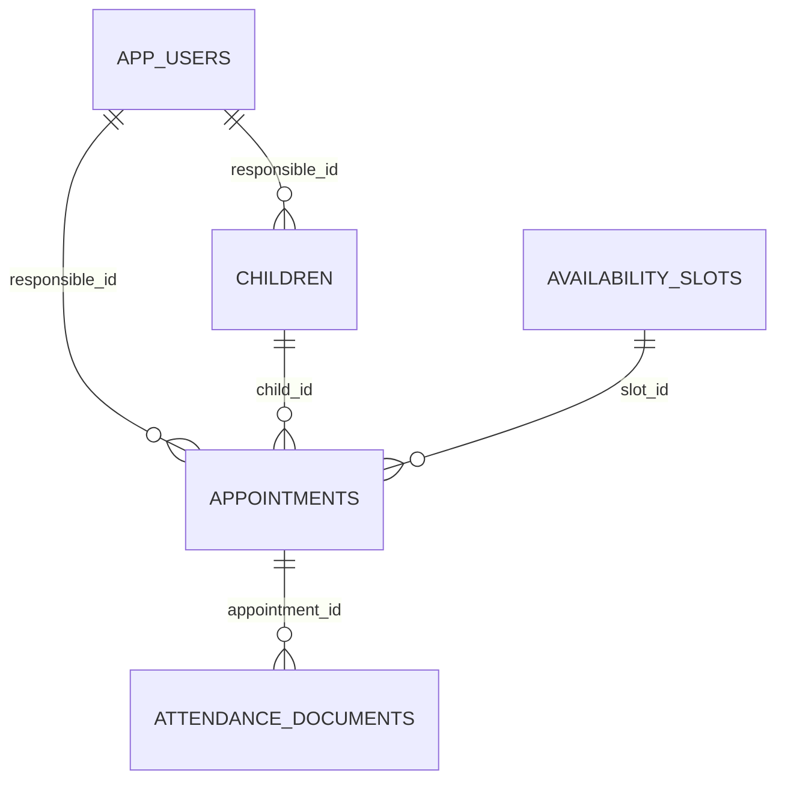

# Banco de dados — NeuroPP Ivina

## 1. Tecnologia

O backend utiliza PostgreSQL. O ambiente Docker usa a imagem:

```text
postgres:17-alpine
```

O Flyway cria e valida o esquema. O Hibernate usa:

```properties
spring.jpa.hibernate.ddl-auto=validate
```

Isso significa que o Hibernate verifica se as entidades são compatíveis com as tabelas, mas não altera o banco automaticamente.

## 2. Diagrama lógico



## 3. Tabelas

### 3.1 `app_users`

Armazena administradores e responsáveis.

| Campo | Tipo | Observação |
|---|---|---|
| `id` | UUID | chave primária |
| `name` | varchar(150) | nome completo |
| `email` | varchar(254) | único sem diferenciar maiúsculas e minúsculas |
| `phone` | varchar(20) | telefone normalizado |
| `password_hash` | varchar(100) | hash BCrypt, nunca senha em texto puro |
| `role` | varchar(30) | `ADMIN` ou `RESPONSIBLE` |
| `active` | boolean | permite desativar a conta |
| `token_version` | integer | revoga tokens antigos quando incrementado |
| `version` | bigint | bloqueio otimista |
| `created_at` | timestamptz | auditoria |
| `updated_at` | timestamptz | auditoria |

A unicidade do e-mail é garantida por um índice em `LOWER(email)`.

### 3.2 `children`

Armazena crianças vinculadas a uma conta responsável.

| Campo | Tipo | Observação |
|---|---|---|
| `id` | UUID | chave primária |
| `name` | varchar(150) | nome da criança |
| `age` | integer | restrita entre 0 e 17 |
| `responsible_id` | UUID | FK para `app_users` |
| `version` | bigint | bloqueio otimista |
| `created_at` | timestamptz | auditoria |
| `updated_at` | timestamptz | auditoria |

A API garante que o responsável autenticado acesse somente as próprias crianças.

### 3.3 `availability_slots`

Representa os intervalos oferecidos para agendamento.

| Campo | Tipo | Observação |
|---|---|---|
| `id` | UUID | chave primária |
| `date` | date | data do atendimento |
| `start_time` | time | início |
| `end_time` | time | fim, obrigatoriamente posterior ao início |
| `is_available` | boolean | disponibilidade funcional |
| `is_blocked` | boolean | bloqueio administrativo |
| `deleted_at` | timestamptz | exclusão lógica |
| `version` | bigint | bloqueio otimista |
| `created_at` | timestamptz | auditoria |
| `updated_at` | timestamptz | auditoria |

Uma exclusion constraint GiST impede intervalos sobrepostos no mesmo dia.

Exemplo permitido:

```text
09:00–10:00
10:00–11:00
```

Exemplo bloqueado:

```text
09:00–10:00
09:30–10:30
```

### 3.4 `appointments`

Relaciona responsável, criança e horário.

| Campo | Tipo | Observação |
|---|---|---|
| `id` | UUID | chave primária |
| `responsible_id` | UUID | FK para `app_users` |
| `child_id` | UUID | FK para `children` |
| `slot_id` | UUID | FK para `availability_slots` |
| `status` | varchar(30) | estado do fluxo |
| `notes` | text | observações opcionais |
| `hidden_for_responsible` | boolean | oculta apenas na visão do responsável |
| `hidden_for_admin` | boolean | oculta apenas na visão administrativa |
| `cancelled_at` | timestamptz | data de cancelamento |
| `rescheduled_at` | timestamptz | data de reagendamento |
| `completed_at` | timestamptz | data de conclusão |
| `version` | bigint | bloqueio otimista |
| `created_at` | timestamptz | auditoria |
| `updated_at` | timestamptz | auditoria |

Status aceitos:

```text
PENDING
CONFIRMED
RESCHEDULED
CANCELLED
ATTENDED
MISSED
COMPLETED
```

Um índice único parcial permite vários registros cancelados para o mesmo slot, mas impede mais de um agendamento ativo.

### 3.5 `attendance_documents`

Armazena documentos relacionados ao atendimento.

| Campo | Tipo | Observação |
|---|---|---|
| `id` | UUID | chave primária |
| `appointment_id` | UUID | FK para `appointments` |
| `title` | varchar(180) | título |
| `document_type` | varchar(40) | categoria |
| `content` | text | conteúdo textual opcional |
| `file_url` | varchar(2048) | referência de arquivo opcional |
| `is_released` | boolean | controla acesso do responsável |
| `released_at` | timestamptz | data da liberação |
| `version` | bigint | bloqueio otimista |
| `created_at` | timestamptz | auditoria |
| `updated_at` | timestamptz | auditoria |

Tipos aceitos:

```text
EVALUATION
SESSION
DEVOLUTION
GUIDANCE
```

O banco exige que pelo menos `content` ou `file_url` esteja preenchido.

## 4. Integridade referencial

As FKs usam `ON DELETE RESTRICT`. Isso evita apagar uma conta, criança, horário ou agendamento enquanto existem registros dependentes.

Essa decisão preserva histórico, mas exige um fluxo específico de anonimização ou retenção para uma futura versão com dados reais.

## 5. Migrações Flyway

Local esperado:

```text
backend/src/main/resources/db/migration/
```

Migration inicial:

```text
V1__create_neuropp_schema.sql
```

Regras importantes:

1. migrations aplicadas não devem ser editadas depois de publicadas;
2. cada alteração futura deve criar uma nova migration;
3. use nomes sequenciais e descritivos;
4. teste em banco descartável antes de aplicar em produção.

Exemplo:

```text
V2__add_birth_date_to_children.sql
V3__create_password_reset_tokens.sql
```

## 6. Extensão `btree_gist`

A migration executa:

```sql
CREATE EXTENSION IF NOT EXISTS btree_gist;
```

Ela é necessária para a regra de não sobreposição dos horários. Antes do deploy, confirme que o PostgreSQL gerenciado permite instalar ou usar essa extensão.

## 7. Configuração local

Variáveis principais:

```env
POSTGRES_DB=neuropp_db
POSTGRES_USER=neuropp_user
POSTGRES_PASSWORD=VALOR_LOCAL_FORTE
DB_PORT=5433
```

A API local usa, por padrão:

```text
jdbc:postgresql://localhost:5433/neuropp_db
```

Dentro do Docker Compose, a API usa o hostname do serviço:

```text
jdbc:postgresql://db:5432/neuropp_db
```

## 8. Banco de staging e banco local

Não envie o banco local para o GitHub. No deploy, crie um PostgreSQL novo e configure a API com as credenciais do provedor.

```text
Banco local
→ desenvolvimento no computador

Banco de staging
→ demonstração publicada com dados fictícios
```

Não use o mesmo banco para desenvolvimento e produção.

## 9. Backup e restauração

Antes de alterar uma base que contenha informações importantes:

```bash
pg_dump --format=custom --file=neuropp.backup DATABASE_URL
```

Restauração em uma base vazia:

```bash
pg_restore --clean --if-exists --dbname=DATABASE_URL neuropp.backup
```

Os comandos exatos podem variar conforme o provedor. Nunca salve o backup no repositório.

## 10. Dados sensíveis

Não versionar:

- dumps SQL;
- volumes do PostgreSQL;
- senhas;
- registros reais de pacientes;
- documentos clínicos;
- logs contendo dados pessoais.

## 11. Evoluções recomendadas

- substituir `age` por `birth_date`;
- criar trilha de auditoria de alterações;
- criar estratégia de anonimização e retenção;
- usar armazenamento privado de arquivos;
- implementar migrations de índices para consultas futuras;
- testar migrations em PostgreSQL real no pipeline.
